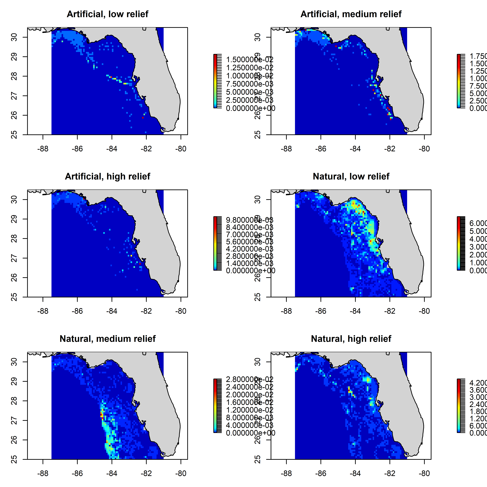
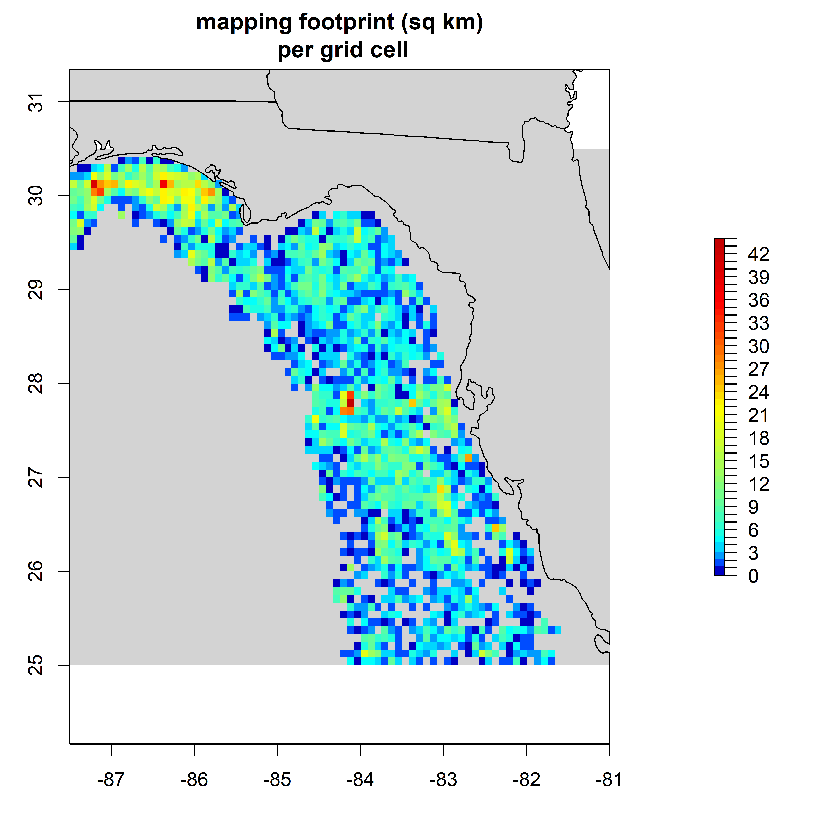

# GFISHER

R code that converts the FWRI side-scan sonar microgrid + digitized habitat polygons into per-cell proportional habitat-coverage rasters for the West Florida Shelf Ecospace model. The driver script (`process GFISHER data.R`) reads a user-supplied geodatabase, a depth raster shipped with the repo, and writes ASCII rasters and summary plots for six habitat classes (artificial / natural × low / medium / high relief).

## Repository layout

```
GFISHER/
  process GFISHER data.R     # driver: USER INPUTS at top, then calls the two habitat-mapping functions
  R/
    GFISHER functions.R      # helper functions (loads sf, sp, lwgeom, gstat, colorRamps, maps)
  maps/
    bathymetry/              # ships with repo: depth + exclusion-mask rasters at 5min and 15min
    GFISHER/                 # generated outputs (gitignored)
```

The user's local `.gdb` is referenced via the `file.gdb` USER INPUT and is **not** stored in the repo.

## Requirements

R (4.x) with the following CRAN packages: `raster`, `terra`, `sf`, `sp`, `lwgeom`, `gstat`, `colorRamps`, `maps`.

`raster` is loaded by the driver script; the rest are loaded inside `R/GFISHER functions.R` (and `terra` inside `fn.make_GFISHER_habitat_maps`).

## User-supplied input

The only paths the user must edit are in the **USER INPUTS** block at the top of `process GFISHER data.R`:

| Variable   | What it is                                                                                                                       |
|------------|----------------------------------------------------------------------------------------------------------------------------------|
| `file.gdb` | Absolute path to your local copy of `GFISHER_EAST_Universe_2026.gdb`. Not shipped with the repo; provided by FWRI to project collaborators. |
| `res`      | Map resolution in arc-minutes. `5` or `15` work out of the box (matching depth/exclusion rasters in `maps/bathymetry/`).         |

## What `process GFISHER data.R` does

1. **Setup** — sets `file.gdb` and `res` via the USER INPUTS block, sources `R/GFISHER functions.R`, and creates `maps/GFISHER/` for outputs.
2. **Pick the depth raster** for the chosen `res` from `maps/bathymetry/`.
3. **Build the habitat maps** by calling `fn.make_GFISHER_habitat_maps(depth, file.gdb, dir.maps)`.
4. **Render the figures** by calling `fn.plot_GFISHER_habitats(file.path(dir.maps, paste0(res,'min')))`.

## Function reference

### `fn.make_GFISHER_habitat_maps(file.gdb, dir.maps, depth)`

Defined in `R/GFISHER functions.R`. Builds the per-cell proportional habitat-coverage rasters that Ecospace consumes.

**Inputs**
- `file.gdb` — path to the GFISHER East Universe geodatabase.
- `dir.maps` — base output directory; the function writes into `dir.maps/<res>min/`.
- `depth`   — a `raster::RasterLayer` defining the target grid (CRS + extent + resolution).

**Behavior**
1. Reads the `Microgrid` (0.1 × 0.1 nm side-scan mapping footprint cells) and `…Dissolve…` (digitized habitat polygons / Geoforms) layers from the geodatabase.
2. Drops habitat class `AP`, removes any `MULTISURFACE` geometries, and derives a 2-letter habitat code (`AL/AM/AH/NL/NM/NH` for artificial-low/medium/high and natural-low/medium/high relief).
3. Reprojects both shapefiles to the depth grid's CRS, converts polygons to centroids, and intersects habitat centroids with the microgrid to attach a `MicroGrid` ID.
4. Runs sanity checks (microgrid coverage, habitat-area-vs-grid-area ratios) and writes an exception CSV if any cell's habitat exceeds its mapped area.
5. Rasterizes the mapping footprint (`Shape_Area` summed per cell) onto the depth grid; masks land/no-depth cells.
6. For each habitat class:
   - rasterizes that class's polygon centroids and divides by the mapping footprint → per-cell proportion.
   - **natural classes (`NL/NM/NH`)**: fills unmapped/water cells using a local inverse-distance-weighted interpolation (`idw_fill_raster_longlat()` helper, projected through an Albers equal-area CRS, with `idp=4, nmax=8`). Result clamped to [0, 1].
   - **artificial classes (`AL/AM/AH`)**: water cells outside the mapping footprint are set to 0 (no extrapolation — artificial structure is point-like).
7. Writes results to disk.

**Outputs** (under `dir.maps/<res>min/`)
- `GFISHER_AL_prop_<res>min_<rows>x<cols>.asc` (and `AM`, `AH`, `NL`, `NM`, `NH`)
- `GFISHER_microgrid_<res>min_<rows>x<cols>.asc` — mapping footprint area per cell.

### `fn.plot_GFISHER_habitats(dir.maps)`

Defined in `R/GFISHER functions.R`. Renders summary figures from the ASCII rasters written by `fn.make_GFISHER_habitat_maps()`.

**Inputs**
- `dir.maps` — the resolution-specific subdirectory (e.g. `maps/GFISHER/5min`).

**Behavior**
- Reads all `.asc` files in that directory, splits them into the six habitat-class rasters and the microgrid raster.
- For each habitat class, builds a breaks vector that gives the zero-class its own bin and uses `colorRamps::matlab.like2` with a small bias (`bias=2`) so non-zero values remain visible against the saturated maximum.
- Plots a 3×2 panel of the habitat proportion rasters with the state coastline overlaid.
- Plots a separate single-panel figure of mapping footprint area (km²) per cell.

**Outputs**
- `Habitat prop area <res>min.png`
- `mapping footprint <res>min.png`

## Worked example — habitat maps from a fresh clone

```r
library('raster')
source(file.path('R', 'GFISHER functions.R'))

dir.gfisher <- getwd()
dir.maps    <- file.path(dir.gfisher, 'maps', 'GFISHER')
dir.create(dir.maps, recursive = TRUE, showWarnings = FALSE)

file.gdb <- "C:/path/to/your/GFISHER_EAST_Universe_2026.gdb"
res      <- 5

file.depth <- list.files(file.path(dir.gfisher, 'maps', 'bathymetry'),
                         pattern = paste0("^depth ", res, "min.*\\.asc$"),
                         full.names = TRUE)
depth <- raster(file.depth)

fn.make_GFISHER_habitat_maps(file.gdb = file.gdb, dir.maps = dir.maps, depth = depth)
fn.plot_GFISHER_habitats(dir.maps = file.path(dir.maps, paste0(res, 'min')))
```

Expected outputs in `maps/GFISHER/5min/`:

- `GFISHER_AL_prop_5min_66x78.asc`, `_AM_`, `_AH_`, `_NL_`, `_NM_`, `_NH_`
- `GFISHER_microgrid_5min_66x78.asc`
- `Habitat prop area 5min.png`
- `mapping footprint 5min.png`

### Example output (5min)

Six-panel habitat proportion figure produced by `fn.plot_GFISHER_habitats()`:



Mapping footprint (km² of side-scan coverage per grid cell):



## Notes

- The geodatabase read + polygon-centroid intersection + IDW fill is the slow step (minutes at 5min resolution). Once the `.asc` outputs exist they can be reused directly.
- `data/*.gdb/`, `maps/GFISHER/`, and `hoard/` are gitignored.
