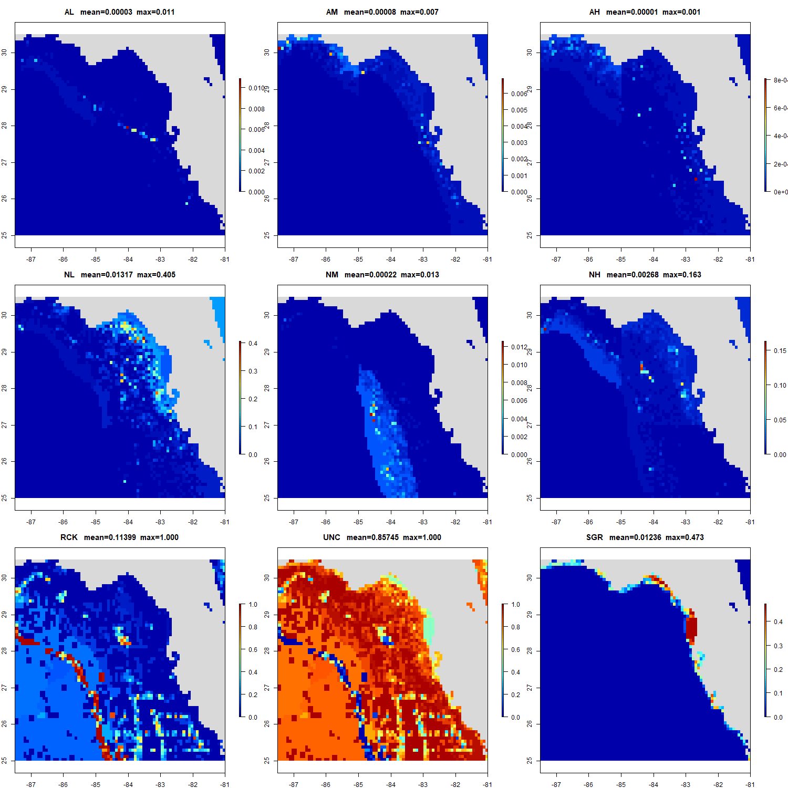

# GFISHER

R pipeline that turns the FWRI GFISHER side-scan habitat mapping and the 3LABS video survey
into inputs for the West Florida Shelf Ecospace model: sum-to-1 habitat basemaps, per-group
MaxN heatmaps, and habitat affinities for each model group. One driver script,
`process GFISHER data.R`, runs four numbered stages.

| Stage | Code | Produces |
|---|---|---|
| 1 Habitat basemaps | `R/habitat_basemaps.R` | Nine layers that sum to 1 in every water cell: six GFISHER reef classes (`AL AM AH NL NM NH`), rock (`RCK`), unconsolidated bottom (`UNC`), seagrass (`SGR`) |
| 2 Video dataset | `R/video_dataset.R` | Station x model-group MaxN table from the 3LABS survey files and the species list |
| 3 MaxN heatmaps | `R/maxn_maps.R` | One raster per model group on the Ecospace grid |
| 4a Selection-ratio affinities | `R/selection_ratio_affinities.R` | Use/availability ratios of each group against the stage 1 layers, with bootstrap intervals |
| 4b Site-level affinities | `R/site_level_affinities.R` | Relative density by habitat class read at each video station |
| 4c Substrate affinities | `R/substrate_affinities.R` | Rock / gravel / sand / mud affinities from the raw dbSEABED grids |

The retired cell-area habitat maps (`R/legacy/habitat_maps_cellarea.R`) were removed under
issue #3; Known caveats says where they live now.

Tested with R 4.5.1 on Windows 11 (October 2026). A full run takes about 16 minutes; reading
the geodatabase in stage 1 is the slow part.

## Quick start

1. Clone the repo and open `GFISHER.Rproj` in RStudio (or `setwd()` to the repo root). The
   driver refuses to run from anywhere else.
2. Install the packages (one line, printed by the driver if any is missing):
   ```r
   install.packages(c("sf", "sp", "raster", "FNN", "colorRamps", "reshape2", "truncnorm", "readxl"))
   ```
3. Get the inputs that cannot ship with the repo (next section) and, if they are not in the
   default folders, copy `config.local.example.R` to `config.local.R` and point at them.
4. `source("process GFISHER data.R")`, or from a terminal `Rscript "process GFISHER data.R"`.

Before anything slow runs, the driver prints an input check like this and stops if a
required input is missing:

```
Input check
----------------------------------------------------------------------------------------------------
  input         stage    need     how      status / path
  bathymetry    1,3,4    required repo     OK       .../data/bathymetry/depth 5min 66x78.asc
  species_list  2        required repo     OK       .../data/Master Species List.xlsx
  geodatabase   1,4b,4c  required manual   OK       .../data/April2026/GFISHER_EAST_Universe_2026.gdb
  survey_maxn   2        required manual   OK       .../data/April2026/maxn3LABS_93to24.csv
  survey_env    2,4      required manual   OK       .../data/April2026/env3LABS_93to24.csv
  survey_lens   2        required manual   OK       .../data/April2026/lens3LABS_93to24.csv
  dbseabed      1,4c     required repo     OK       .../data/dbseabed
  seagrass      1        optional derived  OK       .../data/seagrass/seagrass_5min.asc
```

## Getting the data

Everything the pipeline reads, where it comes from, and how a new user obtains it. Sizes are
approximate.

| Input | Size | How | Where it goes |
|---|---|---|---|
| Depth grids, 5 and 15 arc-min | 100 KB | ships with the repo (values from `EcospaceBasemap` section 1, ETOPO 2022; MD5s and why the raster-written file is kept as the template in `data/bathymetry/SOURCE.md`) | `data/bathymetry/`, or set `dir.bathy` |
| `Master Species List.xlsx` (species to model-group key, size-at-age stanzas) | 220 KB | ships with the repo | `data/` |
| `GFISHER_EAST_Universe_2026.gdb` (FWRI side-scan habitat mapping; layers `East_Master_Hab_Data_FINAL_2026`, `East_Master_Microgrid_Mapped_2026`) | 275 MB | **by request** from FWRI (Sean Keenan) or the repo author; cannot be redistributed on GitHub | `data/April2026/`, or set `dir.data` / `file.gdb` |
| `maxn3LABS_93to24.csv`, `env3LABS_93to24.csv`, `lens3LABS_93to24.csv` (FWRI 3LABS video survey 1993 to 2024) | 42 MB | **by request**, same source | `data/April2026/`, or set `dir.data` |
| dbSEABED raw grids `Gmf_{RCK,GVL,SND,MUD}/gmf_*_val.asc` | 4.4 MB | ships with the repo (public data from [CSDMS dbSEABED](https://csdms.colorado.edu/wiki/DBSEABED); MD5s and provenance in `data/dbseabed/SOURCE.md`; byte-identical to EcospaceBasemap's copy, whose `fn.pull_dbseabed()` is the download path) | `data/dbseabed/`, or set `dir.dbseabed` or `dir.ecospace.basemap` |
| `seagrass_5min.asc`, `seagrass_15min.asc` (seagrass cover on the model grid, derived from [FWC Seagrass Habitat in Florida](https://geodata.myfwc.com/datasets/myfwc::seagrass-habitat-in-florida) by the `EcospaceBasemap` repo) | 50 KB | ship with the repo (byte copies of EcospaceBasemap's tracked outputs; MD5s in `data/seagrass/SOURCE.md`); optional: without one the `SGR` layer is zero | `data/seagrass/`, or set `file.seagrass` or `dir.ecospace.basemap` |

Three of these inputs are produced by the sibling [`EcospaceBasemap`](https://github.com/WFS-FEM/EcospaceBasemap)
repository, which builds the WFS Ecospace basemaps: the depth values, the seagrass rasters
and the dbSEABED grids. They ship here as byte-identical copies so a clone runs on its own;
each `SOURCE.md` records the MD5s and the EcospaceBasemap commit, and EcospaceBasemap's
`output/<res>min/CHECKSUMS.md5` lists the same values. If you hold a clone of EcospaceBasemap,
set `dir.ecospace.basemap` in `config.local.R` and the driver reads its files directly instead
(all but the depth template; `data/bathymetry/SOURCE.md` says why).

Expected `data/` tree once everything is in place:

```
data/
  bathymetry/            depth 5min 66x78.asc, depth 15min 22x26.asc, excl layer *.asc, SOURCE.md (tracked)
  Master Species List.xlsx                                                               (tracked)
  April2026/             GFISHER_EAST_Universe_2026.gdb/, maxn/env/lens 3LABS_93to24.csv (gitignored)
  dbseabed/              Gmf_RCK/ Gmf_GVL/ Gmf_SND/ Gmf_MUD/, SOURCE.md                   (tracked)
  seagrass/              seagrass_5min.asc, seagrass_15min.asc, SOURCE.md                (tracked)
```

If you keep the FWRI files somewhere else (a shared drive, a OneDrive sync), do not copy them:
point `dir.data` at that folder in `config.local.R`. On Windows a directory junction
(`New-Item -ItemType Junction -Path data\April2026 -Target <folder>`) also works and is ignored
by git.

## Configuration

Defaults live in the SETTINGS block of the driver and are repo-relative. Override any of them
in `config.local.R` (gitignored; `config.local.example.R` documents every key). The driver
sources it after the defaults and before reading any input.

| Key | Default | Purpose |
|---|---|---|
| `res` | `5` | Grid resolution in arc-minutes, 5 or 15 |
| `group.scheme` | `'mice'` | Species grouping: `'mice'` or `'ecospace'` columns of the species list |
| `seed` | `1` | Seed for the stage 2 length draws (see Known caveats). `NULL` = unseeded |
| `dir.data` | `data/April2026` | Folder with the geodatabase and the three survey CSVs |
| `file.gdb` | `NULL` | Geodatabase path; `NULL` finds the single `GFISHER_EAST_Universe*.gdb` in `dir.data` |
| `dir.bathy` | `data/bathymetry` | Depth grids |
| `file.spplist` | `data/Master Species List.xlsx` | Species list |
| `dir.ecospace.basemap` | `NULL` | A clone of `EcospaceBasemap`; when set, `dir.dbseabed` and `file.seagrass` resolve inside it unless given explicitly |
| `dir.dbseabed` | `NULL` | Raw dbSEABED grids; `NULL` = `<clone>/data/dbseabed` if `dir.ecospace.basemap` is set, else `data/dbseabed` |
| `file.seagrass` | `NULL` | Seagrass raster; `NULL` = the clone's `seagrass_coverage_Seagrass_Statewide_<res>min.asc` if `dir.ecospace.basemap` is set, else `data/seagrass/seagrass_<res>min.asc` |
| `dir.ecospace.maps` | `NULL` | The author's external Ecospace maps tree; only sets `dir.ewemaps` |
| `dir.maps` | `output/maps` | Output root for stage 3 |
| `dir.ewemaps` | `NULL` | Where MaxN heatmaps are written; `NULL` = `dir.maps` |

The original author's setup is two lines in his `config.local.R`: `dir.dbseabed` and
`dir.ecospace.maps` pointing at his existing trees, and nothing else. A machine holding both
repositories needs only `dir.ecospace.basemap`.

## Outputs

```
output/
  basemaps/<res>min/       habitat_<CODE>_<res>min_<rows>x<cols>.asc  (9 layers)      tracked deliverable
                           habitat_basemap_QC_<res>min.csv, habitat_basemaps_<res>min.png
  maps/GFISHER/<res>min/maxn/<scheme>/
                           GFISHER_maxn_mod<N>_<group>_<res>min_<rows>x<cols>.asc (one per group)
                           GFISHER_maxn_heatmaps_<res>min_<rows>x<cols>.pdf
  affinity_selratio_<scheme>/   selection_ratios_long_<res>min.csv, affinity_A_wide_<res>min.csv,
                                availability_coverage_<res>min.csv, selection_ratio_fits_<res>min.pdf,
                                GFISHER_survey_effort_<res>min_<rows>x<cols>.asc
  affinity_site_<scheme>/       site_affinity_*_<scheme>.csv / .pdf
  affinity_substrate_<scheme>/  substrate_affinity_*_<scheme>.csv / .pdf, substrate_coverage_<scheme>.csv
  GFISHER_species_fg_<scheme>.csv   survey taxon -> model group key (gitignored)
```

Stage 1 writes into `output/basemaps/` in place, so a rebuild shows up in `git diff`. These
nine layers are what stage 4a reads. Whether they, or the ten-layer set that `EcospaceBasemap`
builds (rock dissolved into the natural reef classes, sand/mud/gravel split, combined seagrass),
are the basemap the WFS Ecospace model reads is an open question for the author; the two
products and the options are compared in `docs/issue3-remove-redundant-basemap-code-plan.md`.

The stage 1 panel figure:



## What the basemaps mean

The six reef classes are a two-letter code from the FWRI `NewHabStrat` field: `A`/`N` for
artificial or natural, `L`/`M`/`H` for low, medium or high relief. Reef density is the mapped
reef area divided by the **scanned** area of each cell (GFISHER has scanned about 3% of the
domain), then shrunk toward a region x depth-bin average in cells with little scanning. Rock
comes from the raw dbSEABED rock fraction; unconsolidated bottom is what remains; seagrass is
area-averaged from the seagrass raster. The nine layers are normalised to sum to exactly 1 in
every water cell, and reef is forced to zero below 300 m. The header of
`R/habitat_basemaps.R` records the alternatives that were tried and why they were rejected.

## For collaborators

- **Your paths are yours.** Nothing machine-specific belongs in tracked files; it goes in
  `config.local.R`.
- **Contributing changes.** Open an issue, create the branch from its Development sidebar
  (`N-short-description`), commit with `(issue #N)` in the subject, and open a pull request
  against `main` with `Fixes #N` in the body. Split code, documentation, regenerated outputs
  and housekeeping into separate commits.
- **Review history.** The October 2026 reproducibility review is documented in
  `docs/issue2-review-gfisher-repo-plan.md` (findings, evidence, decisions).

## Known caveats

1. **Stanza assignment is a random draw.** Stage 2 gives each gag and red grouper individual a
   length (drawn, or sampled from the station's measured lengths) and assigns an age stanza
   from it. Totals per station and species are exact; the split among stanzas changes with
   the seed. With `seed = 1` the run is reproducible, but the stanza-level maps remain one
   realisation of that draw. How much this matters for the affinities is tracked in issue #5.
2. **Seagrass.** The shipped `data/seagrass/seagrass_<res>min.asc` files come from
   `EcospaceBasemap`. The author's original basemaps used his own rasterisations of the same
   FWC layer; at 5 min the two agree in all but 45 of 3,838 water cells (seagrass fraction
   differs by up to 0.08 there), and his 15-min raster was never available. The basemaps in
   this repo, at both resolutions, are built from the shipped files, so the 15-min set differs
   from the author's originals in its seagrass cells. EcospaceBasemap's own basemap uses a
   different seagrass layer (the maximum of the FWC and NOAA GulfwideSAV layers); which one
   the basemap should use is a question for the author (issue #3).
3. **Stations on grid lines.** Eleven survey stations sit exactly on a 5-minute latitude line.
   Which cell they fall in depends on the template grid's header; the driver checks that all
   grids share one template so the assignment is consistent within a run.
4. **Windows plot windows.** Interactive runs on Windows open a recording graphics window;
   `Rscript` and other platforms skip it. Figures are written to files either way.
5. **Legacy cell-area maps and geodatabases.** `R/legacy/habitat_maps_cellarea.R` (the
   pre-August-2026 reef maps: reef area over scanned area, IDW fill, 200 m cutoff, no sum-to-1)
   was deleted under issue #3. Its last version is in `main` at commit `62f7a08`
   (`git show 62f7a08:R/legacy/habitat_maps_cellarea.R`), and `EcospaceBasemap`
   `R/GFISHER functions.R` is its terra port (`anchor.zero='both'` reproduces it). The two
   older geodatabases it read (`East_Master_Hab_data_Dissolve_byMicro_13Sept24.gdb`,
   `FWRI_East_Gulf_Mapping_2023.gdb`) were untracked in October 2026 and remain in git history.

## Reproducibility

- A fresh clone with only `config.local.R` added runs end to end under `Rscript`.
- Stage 1 basemaps regenerate byte-identical given the same inputs (verified on a second
  machine, October 2026).
- Stages 2 to 4 are deterministic given `seed`.
- MD5 comparison of outputs: `tools::md5sum(list.files("output/basemaps/5min", "\\.asc$", full.names=TRUE))`.
  Grids and tables are stored and checked out with LF line endings (`.gitattributes`), so the
  MD5 of a checked-out file equals the one git stores; a file freshly written by `raster` on
  Windows has CRLF and hashes differently until it is committed and checked out again.
- The shipped inputs match their producer: the MD5s in `data/*/SOURCE.md` equal the entries in
  `EcospaceBasemap`'s `output/<res>min/CHECKSUMS.md5` (the dbSEABED grids are inputs there
  too; its `data/dbseabed/SOURCE.md` lists the same values).
- A run with `dir.ecospace.basemap` set produces the same outputs as a run on the shipped
  copies (verified 6 Oct 2026; see the issue #3 plan document).
